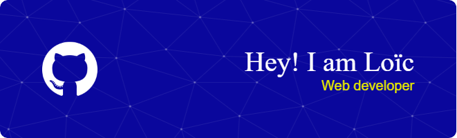

<h1 align="center">Hi 👋, I'm Loïc</h1>
<h3 align="center">A passionate web development student at Elan Formation</h3>
<h2>What I'm currently learning 📚</h2>
Frontend: React API calls  
Backend: Webapp creation with Symfony, API creation with Symfony
---

### 🛠️ Languages and Tools:

  
  
  
  
  
  
  
  

---

### 📊 My GitHub Statistics:

  <picture>
    <source media="(prefers-color-scheme: dark)" srcset="https://github-readme-stats.vercel.app/api?username=Loic-1&theme=tokyonight&show_icons=true&hide_border=true&count_private=true">
    <source media="(prefers-color-scheme: light)" srcset="https://github-readme-stats.vercel.app/api?username=Loic-1&theme=default&show_icons=true&hide_border=true&count_private=true">
    
  </picture>
  
   

  <picture>
    <source media="(prefers-color-scheme: dark)" srcset="https://github-readme-stats.vercel.app/api/top-langs/?username=Loic-1&theme=tokyonight&show_icons=true&hide_border=true&layout=compact">
    <source media="(prefers-color-scheme: light)" srcset="https://github-readme-stats.vercel.app/api/top-langs/?username=Loic-1&theme=default&show_icons=true&hide_border=true&layout=compact">
    
  </picture>

   

  <picture>
    <source media="(prefers-color-scheme: dark)" srcset="https://github-readme-streak-stats.herokuapp.com?user=Loic-1&theme=tokyonight&hide_border=true">
    <source media="(prefers-color-scheme: light)" srcset="https://github-readme-streak-stats.herokuapp.com?user=Loic-1&theme=default&hide_border=true">
    
  </picture>

---

### 🌟 GitHub Trophies:

 
  <picture>
    <source media="(prefers-color-scheme: dark)" srcset="https://github-profile-trophy.vercel.app/?username=loic-1&column=3&theme=onedark&margin-w=15&margin-h=15">
    <source media="(prefers-color-scheme: light)" srcset="https://github-profile-trophy.vercel.app/?username=loic-1&column=3&theme=flat&margin-w=15&margin-h=15">
    
  </picture>

---

### 📫 Connect with Me:

  

---
